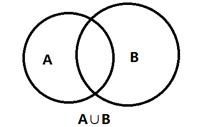
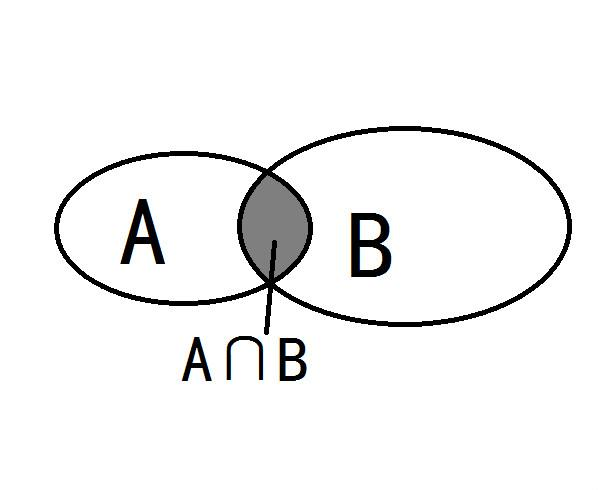
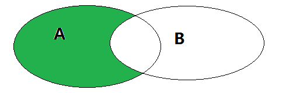
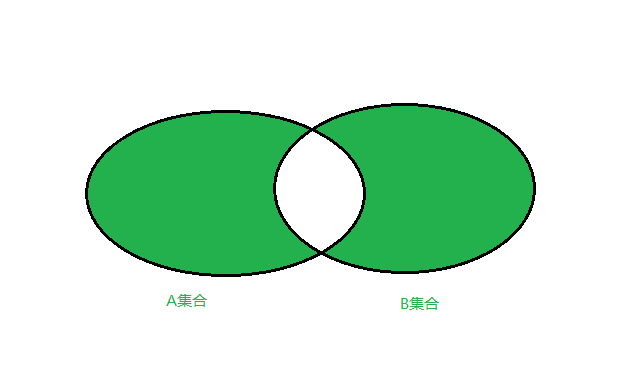

# Python3 集合

set 翻译为集合，是一个**无序的**、**可变的**、**不重复的**元素序列。

collection 翻译为集合类型，是一个大概念

可以使用大括号 { } 或者 set() 函数创建集合，注意：创建一个空集合必须用 set() 而不是 { }，因为 { } 是用来创建一个空字典。

## set定义

+ set() -> new empty set object
+ set(iterable) -> new set object

```bash
s1 = set()
type(s1)
---------------------------------------------------------------------------
set

s2 = set(range(5))
print(s2)
---------------------------------------------------------------------------
{0, 1, 2, 3, 4}

s3 = set(list(range(10)))
print(s3)
---------------------------------------------------------------------------
{0, 1, 2, 3, 4, 5, 6, 7, 8, 9}

s4 = {}
type(s4
---------------------------------------------------------------------------
dict

s5 = {1,2,3,4}
type(s5)
---------------------------------------------------------------------------
set

s6 = {(1,2),3,'a'}
print(s6)
---------------------------------------------------------------------------
{(1, 2), 'a', 3}

s7 = {[1],(1,),1}
print(s7)
---------------------------------------------------------------------------
TypeError                                 Traceback (most recent call last)
<ipython-input-85-3bcf3ef8dc67> in <module>
----> 1 s7 = {[1],(1,),1}
      2 print(s7)

TypeError: unhashable type: 'list'
```

## set的元素

+ set的元素要求必须可以hash
+ 目前学过的不可hash的类型有list、set
+ 元素不可以索引
+ set可以迭代

## set增加

> add(elem)

+ 增加一个元素到set中
+ 如果元素存在，什么都不做

```bash
s = set([1,2,3,4])
print(s)
s.add('abc')
print(s)
s.add(1)
print(s)
---------------------------------------------------------------------------
{1, 2, 3, 4}
{1, 2, 3, 4, 'abc'}
{1, 2, 3, 4, 'abc'}
```

> update(*others)

+ 合并其他元素到set集合中来
+ 参数others必须是**可迭代对象**
+ 就地修改

```bash
s = set([1,2,3,4])
s.update(('a','b','c'))
print(s)
s.update(['o','p','q'])
print(s)
s.update({"x":50,"y":60,"z":70})
print(s)
---------------------------------------------------------------------------
{1, 2, 3, 4, 'b', 'c', 'a'}
{1, 2, 3, 4, 'b', 'c', 'o', 'q', 'p', 'a'}
{1, 2, 3, 4, 'b', 'c', 'o', 'z', 'q', 'p', 'a', 'x', 'y'}
```

## set删除

> remove(elem)

+ 从set中移除一个元素
+ 元素不存在，抛出KeyError异常。为什么是KeyError？

```bash
s = set([1,2,3,4])
print(s)
s.remove(7)
---------------------------------------------------------------------------
{1, 2, 3, 4}
---------------------------------------------------------------------------
KeyError                                  Traceback (most recent call last)
<ipython-input-99-7d9c0c061566> in <module>
      1 s = set([1,2,3,4])
      2 print(s)
----> 3 s.remove(7)

KeyError: 7
```

> discard(elem)

+ 从set中移除一个元素
+ 元素不存在，什么都不做

```bash
s = set([1,2,3,4])
print(s)
s.discard(7)
---------------------------------------------------------------------------
{1, 2, 3, 4}
```

> pop() -> item

+ 移除并返回任意的元素。为什么是任意元素？
+ 空集返回KeyError异常

```bash
s = set([1,2,3,4])
print(s.pop())
print(s.pop())
print(s.pop())
print(s.pop())
print(s.pop())
---------------------------------------------------------------------------
1
2
3
4
---------------------------------------------------------------------------
KeyError                                  Traceback (most recent call last)
<ipython-input-114-29aa55ccdae7> in <module>
      4 print(s.pop())
      5 print(s.pop())
----> 6 print(s.pop())

KeyError: 'pop from an empty set'
```

> clear()

+ 移除所有元素

```bash
s = set([1,2,3,4])
s.clear()
print(s)
---------------------------------------------------------------------------
set()
```

## set修改、查询

> 修改

+ 要么删除，要么加入新的元素
+ 为什么没有修改？

> 查询

+ 非线性结构，无法索引

> 遍历

+ 可以迭代所有元素

> 成员运算符

+ in 和 not in 判断元素是否在set中
+ 效率呢？

```bash
%%timeit lst1 = list(range(100))
a = -1 in lst1
---------------------------------------------------------------------------
1.16 µs ± 2.09 ns per loop (mean ± std. dev. of 7 runs, 1000000 loops each)

%%timeit lst1 = list(range(1000000))
a = -1 in lst1
---------------------------------------------------------------------------
11.5 ms ± 74.5 µs per loop (mean ± std. dev. of 7 runs, 100 loops each)

%%timeit set1 = set(range(100))
a = -1 in set1
---------------------------------------------------------------------------
32.7 ns ± 0.272 ns per loop (mean ± std. dev. of 7 runs, 10000000 loops each)

%%timeit set1 = set(range(1000000))
a = -1 in set1
---------------------------------------------------------------------------
34.1 ns ± 1.5 ns per loop (mean ± std. dev. of 7 runs, 10000000 loops each)

%timeit set1 = set(range(100))
---------------------------------------------------------------------------
2.44 µs ± 28.8 ns per loop (mean ± std. dev. of 7 runs, 100000 loops each)

%timeit set1 = set(range(1000000))
---------------------------------------------------------------------------
103 ms ± 2.45 ms per loop (mean ± std. dev. of 7 runs, 10 loops each)

%timeit lst1 = list(range(100))
---------------------------------------------------------------------------
1.11 µs ± 39.2 ns per loop (mean ± std. dev. of 7 runs, 1000000 loops each)

%timeit lst1 = list(range(1000000))
---------------------------------------------------------------------------
41.5 ms ± 227 µs per loop (mean ± std. dev. of 7 runs, 10 loops each)
```

## set和线性结构

+ 线性结构的查询时间复杂度是O(n)，即随着数据规模的增大而增加耗时
+ set、dict等结构，内部使用hash值作为key，时间复杂度可以做到O(1)，查询时间和数据规模无关
+ set的元素必须是可hash的

> 可hash

+ 数值型int、float、complex
+ 布尔型True、False
+ 字符串string、bytes
+ tuple
+ None
+ 以上都是不可变类型，成为可哈希类型，hashable

## 集合基本概念

> 全集

+ 所有元素的集合。例如实数集，所有实数组成的集合就是全集

> 子集subset和超集superset

+ 一个集合A所有元素都在另一个集合B内，A是B的子集，B是A的超集

> 真子集和真超集

+ A是B的子集，且A不等于B，A就是B的真子集，B是A的真超集

> 并集

+ 多个集合合并的结果

> 交集

+ 多个集合的公共部分

> 差集

+ 集合中除去和其他集合公共部分

## 集合运算

> 并集

+ 将两个集合A和B的所有的元素合并到一起，组成的集合称作集合A与集合B的并集
+ union(*others), 返回和多个集合合并后的新的集合
+ | 运算符重载, 等同union
+ update(*others), 和多个集合合并，就地修改
+ |=, 等同update



```bash
a = {1,2,3,4}
b = {5,6,7,8}
print(a|b)
a |= b
print(a)
print(b)
------------------------------------
{1, 2, 3, 4, 5, 6, 7, 8}
{1, 2, 3, 4, 5, 6, 7, 8}
{8, 5, 6, 7}
```

> 交集

+ 集合A和B，由所有属于A且属于B的元素组成的集合
+ intersection(*others)，返回和多个集合的交集
+ &，等同intersection
+ intersection_update(*others)，获取和多个集合的交集，并就地修改
+ &=，等同intersection_update



```bash
a = {1,2,3,4,5}
b = {3,5,6,7,8}
print(a & b)
a &= b
print(a)
print(b)
------------------------------------
{3, 5}
{3, 5}
{8, 3, 5, 6, 7}
```

> 差集

+ 集合A和B，由所有属于A且不属于B的元素组成的集合
+ difference(*others), 返回和多个集合的差集
+ -, 等同difference
+ difference_update(*others), 获取和多个集合的差集并就地修改
+ -=, 等同difference_update



```bash
a = {1,2,3,4,5}
b = {3,5,6,7,8}
print(a - b)
a -= b
print(a)
print(b)
---------------------------------------
{1, 2, 4}
{1, 2, 4}
{8, 3, 5, 6, 7}
```

> 对称差集

+ 集合A和B，由所有不属于A和B的交集元素组成的集合，记作（A-B）∪（B-A）
+ symmetric_differece(other), 返回和另一个集合的差集
+ ^, 等同symmetric_differece
+ symmetric_differece_update(other), 获取和另一个集合的差集并就地修改
+ ^=, 等同symmetric_differece_update



```bash
a = {1,2,3,4,5}
b = {3,5,6,7,8}
print(a ^ b)
a ^= b
print(a)
print(b)
-----------------------------------------
{1, 2, 4, 6, 7, 8}
{1, 2, 4, 6, 7, 8}
{8, 3, 5, 6, 7}
```

> issubset(other)、<=

+ 判断当前集合是否是另一个集合的子集

> set1 < set2

+ 判断set1是否是set2的真子集

> issuperset(other)、>=

+ 判断当前集合是否是other的超集

> set1 > set2

+ 判断set1是否是set的真超集

> isdisjoint(other)

+ 当前集合和另一个集合没有交集
+ 没有交集，返回True

## 集合内置方法完整列表

方法|描述
:-|:-
add()|为集合添加元素
clear()|移除集合中的所有元素
copy()|拷贝一个集合
difference()|返回多个集合的差集
difference_update()|移除集合中的元素，该元素在指定的集合也存在。
discard()|删除集合中指定的元素
intersection()|返回集合的交集
intersection_update()|返回集合的交集。
isdisjoint()|判断两个集合是否包含相同的元素，如果没有返回 True，否则返回 False。
issubset()|判断指定集合是否为该方法参数集合的子集。
issuperset()|判断该方法的参数集合是否为指定集合的子集
pop()|随机移除元素
remove()|移除指定元素
symmetric_difference()|返回两个集合中不重复的元素集合。
symmetric_difference_update()|移除当前集合中在另外一个指定集合相同的元素，并将另外一个指定集合中不同的元素插入到当前集合中。
union()|返回两个集合的并集
update()|给集合添加元素

## 练习

> 你的好友A、B、C，他的好友C、B、D，求共同好友？

```bash
s1 = {'A','B','C'}
s2 = {'C','B','D'}
print(s1 & s2)
--------------------------------------------
{'B', 'C'}
```

> 有一个API，要求权限同时具备A、B、C才能访问，用户权限是B、C、D，判断用户是否能够访问该API

```bash
API集合A，权限集合P
1、A - P = {}, 说明P包含A
2、A.issubset(P)也行，A是P的子集也行
3、A & P = A也行
```

> 有一个API，要求权限具备A、B、C任意一项就可访问，用户权限是B、C、D，判断用户是否能够访问该API

```bash
API集合A，权限集合P
1、A & P != {} 就可以
2、A.isdisjoint(P) == False 表示有交集
```

> 随机产生2组各10个数字的列表，如下要求：

+ 每个数字取值范围[10,20]？
+ 统计20个数字中，一共有多少个不同的数字？
+ 2组比较，不重复的数字有几个？分别是什么？
+ 2组比较，重复的数字有几个？分别是什么？

```bash
a = [random.randint(10,20) for i in range(10)]
b = [random.randint(10,20) for i in range(10)]
set1 = set(a)
set2 = set(b)
print(set1)
print(set2)
print(set1 | set2)
print(set1 ^ set2)
print(set1 & set2)
--------------------------------------------------------
{10, 14, 16, 17, 18, 19}
{11, 12, 13, 14, 17, 18, 19}
{10, 11, 12, 13, 14, 16, 17, 18, 19}
{16, 10, 11, 12, 13}
{17, 18, 19, 14}
```
