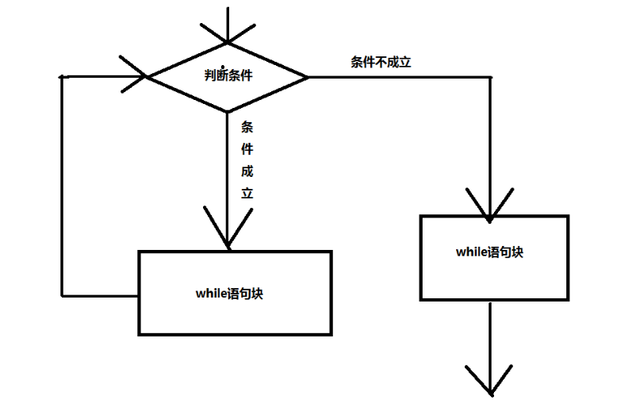

# Python3 循环语句

本章节将为大家介绍Python循环语句的使用。

Python中的循环语句有 for 和 while。

Python循环语句的控制结构图如下所示：



## while 循环

Python中while语句的一般形式：

```bash
while 判断条件：
    语句
```

执行 Gif 演示：


同样需要注意冒号和缩进。另外，在 Python 中没有 do..while 循环。

以下实例使用了 while 来计算 1 到 100 的总和：

```bash
#!/usr/bin/env python3

n = 100

sum = 0
counter = 1
while counter <= n:
    sum = sum + counter
    counter += 1

print("1 到 %d 之和为: %d" % (n,sum))
```

执行结果如下：

```bash
1 到 100 之和为: 5050
```

### 无限循环

我们可以通过设置条件表达式永远不为 false 来实现无限循环，实例如下：

```bash
#!/usr/bin/python3

var = 1
while var == 1 :  # 表达式永远为 true
   num = int(input("输入一个数字  :"))
   print ("你输入的数字是: ", num)

print ("Good bye!")
```

执行以上脚本，输出结果如下：

```bash
输入一个数字  :5
你输入的数字是:  5
输入一个数字  :
```

你可以使用 CTRL+C 来退出当前的无限循环。

无限循环在服务器上客户端的实时请求非常有用。

### while 循环使用 else 语句

在 while … else 在条件语句为 false 时执行 else 的语句块：

```bash
#!/usr/bin/python3

count = 0
while count < 5:
   print (count, " 小于 5")
   count = count + 1
else:
   print (count, " 大于或等于 5")
```

执行以上脚本，输出结果如下：

```bash
0  小于 5
1  小于 5
2  小于 5
3  小于 5
4  小于 5
5  大于或等于 5
```

### 简单语句组

类似if语句的语法，如果你的while循环体中只有一条语句，你可以将该语句与while写在同一行中， 如下所示：

```bash
#!/usr/bin/python

flag = 1

while (flag): print ('欢迎访问菜鸟教程!')

print ("Good bye!")
```

**注意：**以上的无限循环你可以使用 CTRL+C 来中断循环。

执行以上脚本，输出结果如下：

```bash
欢迎访问菜鸟教程!
欢迎访问菜鸟教程!
欢迎访问菜鸟教程!
欢迎访问菜鸟教程!
欢迎访问菜鸟教程!
……
```

## for 语句

Python for循环可以遍历任何序列的项目，如一个列表或者一个字符串。

for循环的一般格式如下：

```bash
for <variable> in <sequence>:
    <statements>
else:
    <statements>
```

Python loop循环实例：

```bash
>>>languages = ["C", "C++", "Perl", "Python"]
>>> for x in languages:
...     print (x)
...
C
C++
Perl
Python
>>>
```
