# Python3 数据结构

本章节我们主要结合前面所学的知识点来介绍Python数据结构。

## 列表

Python中列表是可变的，这是它区别于字符串和元组的最重要的特点，一句话概括即：列表可以修改，而字符串和元组不能。

以下是 Python 中列表的方法：

方法|    描述
:-|:-
list.append(x)|    把一个元素添加到列表的结尾，相当于 a[len(a):] = [x]。
list.extend(L)|    通过添加指定列表的所有元素来扩充列表，相当于 a[len(a):] = L。
list.insert(i, x)|    在指定位置插入一个元素。第一个参数是准备插入到其前面的那个元素的索引，例如 a.insert(0, x) 会插入到整个列表之前，而 a.insert(len(a), x) 相当于 a.append(x) 。
list.remove(x)|    删除列表中值为 x 的第一个元素。如果没有这样的元素，就会返回一个错误。
list.pop([i])|    从列表的指定位置移除元素，并将其返回。如果没有指定索引，a.pop()返回最后一个元素。元素随即从列表中被移除。（方法中 i 两边的方括号表示这个参数是可选的，而不是要求你输入一对方括号，你会经常在 Python 库参考手册中遇到这样的标记。）
list.clear()|    移除列表中的所有项，等于del a[:]。
list.index(x)|    返回列表中第一个值为 x 的元素的索引。如果没有匹配的元素就会返回一个错误。
list.count(x)|    返回 x 在列表中出现的次数。
list.sort()|    对列表中的元素进行排序。
list.reverse()|    倒排列表中的元素。
list.copy()|    返回列表的浅复制，等于a[:]。

下面示例演示了列表的大部分方法：

```bash
>>> a = [66.25, 333, 333, 1, 1234.5]
>>> print(a.count(333), a.count(66.25), a.count('x'))
2 1 0
>>> a.insert(2, -1)
>>> a.append(333)
>>> a
[66.25, 333, -1, 333, 1, 1234.5, 333]
>>> a.index(333)
1
>>> a.remove(333)
>>> a
[66.25, -1, 333, 1, 1234.5, 333]
>>> a.reverse()
>>> a
[333, 1234.5, 1, 333, -1, 66.25]
>>> a.sort()
>>> a
[-1, 1, 66.25, 333, 333, 1234.5]
```

注意：类似 insert, remove 或 sort 等修改列表的方法没有返回值。

### 将列表当做堆栈使用

列表方法使得列表可以很方便的作为一个堆栈来使用，堆栈作为特定的数据结构，最先进入的元素最后一个被释放（后进先出）。用 append() 方法可以把一个元素添加到堆栈顶。用不指定索引的 pop() 方法可以把一个元素从堆栈顶释放出来。例如：

```bash
>>> stack = [3, 4, 5]
>>> stack.append(6)
>>> stack.append(7)
>>> stack
[3, 4, 5, 6, 7]
>>> stack.pop()
7
>>> stack
[3, 4, 5, 6]
>>> stack.pop()
6
>>> stack.pop()
5
>>> stack
[3, 4]
```

### 将列表当作队列使用

也可以把列表当做队列用，只是在队列里第一加入的元素，第一个取出来；但是拿列表用作这样的目的效率不高。在列表的最后添加或者弹出元素速度快，然而在列表里插入或者从头部弹出速度却不快（因为所有其他的元素都得一个一个地移动）。

```bash
>>> from collections import deque
>>> queue = deque(["Eric", "John", "Michael"])
>>> queue.append("Terry")           # Terry arrives
>>> queue.append("Graham")          # Graham arrives
>>> queue.popleft()                 # The first to arrive now leaves
'Eric'
>>> queue.popleft()                 # The second to arrive now leaves
'John'
>>> queue                           # Remaining queue in order of arrival
deque(['Michael', 'Terry', 'Graham'])
```

### 列表推导式

语法

+ [返回值 for 元素 in 可迭代对象 if 条件]
+ 只能用 if 条件单支，不能用 elif 和 else
+ 返回一个新的列表

> 列表解析式是一种语法糖

+ 编译器会优化，不会因为简写而影响效率，反而因优化提高了效率
+ 减少程序员工作量，减少出错
+ 简化了代码，但可读性增强

这里我们将列表中每个数值乘三，获得一个新的列表：

```bash
>>> vec = [2, 4, 6]
>>> [3*x for x in vec]
[6, 12, 18]
```

现在我们玩一点小花样：

```bash
>>> [[x, x**2] for x in vec]
[[2, 4], [4, 16], [6, 36]]
```

这里我们对序列里每一个元素逐个调用某方法：

```bash
>>> freshfruit = ['  banana', '  loganberry ', 'passion fruit  ']
>>> [weapon.strip() for weapon in freshfruit]
['banana', 'loganberry', 'passion fruit']
```

我们可以用 if 子句作为过滤器：

```bash
>>> [3*x for x in vec if x > 3]
[12, 18]
>>> [3*x for x in vec if x < 2]
[]
```

20 以内，既能被 2 整除又能被 3 整除的数

```bash
[ i for i in range(20) if i%2 == 0 and i%3 == 0 ]
------------------------------------------------
[0, 6, 12, 18]

[ i for i in range(20) if i%2 == 0 if i%3 == 0 ]
------------------------------------------------
[0, 6, 12, 18]
```

+ 这两个句子等效

以下是一些关于循环和其它技巧的演示：

```bash
>>> vec1 = [2, 4, 6]
>>> vec2 = [4, 3, -9]
>>> [x*y for x in vec1 for y in vec2]
[8, 6, -18, 16, 12, -36, 24, 18, -54]
>>> [x+y for x in vec1 for y in vec2]
[6, 5, -7, 8, 7, -5, 10, 9, -3]
>>> [vec1[i]*vec2[i] for i in range(len(vec1))]
[8, 12, -54]
```

列表推导式可以使用复杂表达式或嵌套函数：

```bash
>>> [str(round(355/113, i)) for i in range(1, 6)]
['3.1', '3.14', '3.142', '3.1416', '3.14159']
```

### 嵌套列表解析

Python的列表还可以嵌套。

以下实例展示了3X4的矩阵列表：

```bash
>>> matrix = [
...     [1, 2, 3, 4],
...     [5, 6, 7, 8],
...     [9, 10, 11, 12],
... ]
```

以下实例将3X4的矩阵列表转换为4X3列表：

```bash
>>> [[row[i] for row in matrix] for i in range(4)]
[[1, 5, 9], [2, 6, 10], [3, 7, 11], [4, 8, 12]]
```

以下实例也可以使用以下方法来实现：

```bash
>>> transposed = []
>>> for i in range(4):
...     transposed.append([row[i] for row in matrix])
...
>>> transposed
[[1, 5, 9], [2, 6, 10], [3, 7, 11], [4, 8, 12]]
```

另外一种实现方法：

```bash
>>> transposed = []
>>> for i in range(4):
...     # the following 3 lines implement the nested listcomp
...     transposed_row = []
...     for row in matrix:
...         transposed_row.append(row[i])
...     transposed.append(transposed_row)
...
>>> transposed
[[1, 5, 9], [2, 6, 10], [3, 7, 11], [4, 8, 12]]
```

Python 列表嵌套中使用双 if 的情况

```bash
print([ (i,j) for i in range(7) if i>4 for j in range(20,25) if j>23 ])
print([ (i,j) for i in range(7) for j in range(20,25) if i>4 if j>23 ])
print([ (i,j) for i in range(7) for j in range(20,25) if i>4 and j>23 ])
------------------------------------------------------------------------
[(5, 24), (6, 24)]
[(5, 24), (6, 24)]
[(5, 24), (6, 24)]
```

+ 这三句是等效的

### del 语句

使用 del 语句可以从一个列表中依索引而不是值来删除一个元素。这与使用 pop() 返回一个值不同。可以用 del 语句从列表中删除一个切割，或清空整个列表（我们以前介绍的方法是给该切割赋一个空列表）。例如：

```bash
>>> a = [-1, 1, 66.25, 333, 333, 1234.5]
>>> del a[0]
>>> a
[1, 66.25, 333, 333, 1234.5]
>>> del a[2:4]
>>> a
[1, 66.25, 1234.5]
>>> del a[:]
>>> a
[]
```

也可以用 del 删除实体变量：

```bash
>>> del a
```

## 元组和序列

元组由若干逗号分隔的值组成，例如：

```bash
>>> t = 12345, 54321, 'hello!'
>>> t[0]
12345
>>> t
(12345, 54321, 'hello!')
>>> # Tuples may be nested:
... u = t, (1, 2, 3, 4, 5)
>>> u
((12345, 54321, 'hello!'), (1, 2, 3, 4, 5))
```

如你所见，元组在输出时总是有括号的，以便于正确表达嵌套结构。在输入时可能有或没有括号， 不过括号通常是必须的（如果元组是更大的表达式的一部分）。

## 集合

集合是一个无序不重复元素的集。基本功能包括关系测试和消除重复元素。

可以用大括号({})创建集合。注意：如果要创建一个空集合，你必须用 set() 而不是 {} ；后者创建一个空的字典，下一节我们会介绍这个数据结构。

以下是一个简单的演示：

```bash
>>> basket = {'apple', 'orange', 'apple', 'pear', 'orange', 'banana'}
>>> print(basket)                      # 删除重复的
{'orange', 'banana', 'pear', 'apple'}
>>> 'orange' in basket                 # 检测成员
True
>>> 'crabgrass' in basket
False

>>> # 以下演示了两个集合的操作
...
>>> a = set('abracadabra')
>>> b = set('alacazam')
>>> a                                  # a 中唯一的字母
{'a', 'r', 'b', 'c', 'd'}
>>> a - b                              # 在 a 中的字母，但不在 b 中
{'r', 'd', 'b'}
>>> a | b                              # 在 a 或 b 中的字母
{'a', 'c', 'r', 'd', 'b', 'm', 'z', 'l'}
>>> a & b                              # 在 a 和 b 中都有的字母
{'a', 'c'}
>>> a ^ b                              # 在 a 或 b 中的字母，但不同时在 a 和 b 中
{'r', 'd', 'b', 'm', 'z', 'l'}
```

集合也支持推导式：

```bash
>>> a = {x for x in 'abracadabra' if x not in 'abc'}
>>> a
{'r', 'd'}
```

### 集合解析式

语法

+ {返回值 for 元素 in 可迭代对象 if 条件}
+ 列表解析式的中括号换成大括号{}就行了
+ 立即返回一个集合

用法

+ {(x,x+1) for x in range(10)}
  + 立即返回 {(0, 1), (1, 2), (2, 3), (3, 4), (4, 5), (5, 6), (6, 7), (7, 8), (8, 9), (9, 10)}
+ {[x] for x in range(10)}
  + 会抛出异常，因为列表不可 hash
  + 集合元素和字典 key 都必须可 hash

## 字典

另一个非常有用的 Python 内建数据类型是字典。

序列是以连续的整数为索引，与此不同的是，字典以关键字为索引，关键字可以是任意不可变类型，通常用字符串或数值。

理解字典的最佳方式是把它看做无序的键=>值对集合。在同一个字典之内，关键字必须是互不相同。

一对大括号创建一个空的字典：{}。

这是一个字典运用的简单例子：

```bash
>>> tel = {'jack': 4098, 'sape': 4139}
>>> tel['guido'] = 4127
>>> tel
{'sape': 4139, 'guido': 4127, 'jack': 4098}
>>> tel['jack']
4098
>>> del tel['sape']
>>> tel['irv'] = 4127
>>> tel
{'guido': 4127, 'irv': 4127, 'jack': 4098}
>>> list(tel.keys())
['irv', 'guido', 'jack']
>>> sorted(tel.keys())
['guido', 'irv', 'jack']
>>> 'guido' in tel
True
>>> 'jack' not in tel
False
```

构造函数 dict() 直接从键值对元组列表中构建字典。如果有固定的模式，列表推导式指定特定的键值对：

```bash
>>> dict([('sape', 4139), ('guido', 4127), ('jack', 4098)])
{'sape': 4139, 'jack': 4098, 'guido': 4127}
```

此外，字典推导可以用来创建任意键和值的表达式词典：

```bash
>>> {x: x**2 for x in (2, 4, 6)}
{2: 4, 4: 16, 6: 36}
```

如果关键字只是简单的字符串，使用关键字参数指定键值对有时候更方便：

```bash
>>> dict(sape=4139, guido=4127, jack=4098)
{'sape': 4139, 'jack': 4098, 'guido': 4127}
```

### 遍历技巧

在字典中遍历时，关键字和对应的值可以使用 items() 方法同时解读出来：

```bash
>>> knights = {'gallahad': 'the pure', 'robin': 'the brave'}
>>> for k, v in knights.items():
...     print(k, v)
...
gallahad the pure
robin the brave
```

在序列中遍历时，索引位置和对应值可以使用 enumerate() 函数同时得到：

```bash
>>> for i, v in enumerate(['tic', 'tac', 'toe']):
...     print(i, v)
...
0 tic
1 tac
2 toe
```

同时遍历两个或更多的序列，可以使用 zip() 组合：

```bash
>>> questions = ['name', 'quest', 'favorite color']
>>> answers = ['lancelot', 'the holy grail', 'blue']
>>> for q, a in zip(questions, answers):
...     print('What is your {0}?  It is {1}.'.format(q, a))
...
What is your name?  It is lancelot.
What is your quest?  It is the holy grail.
What is your favorite color?  It is blue.
```

要反向遍历一个序列，首先指定这个序列，然后调用 reversed() 函数：

```bash
>>> for i in reversed(range(1, 10, 2)):
...     print(i)
...
9
7
5
3
1
```

要按顺序遍历一个序列，使用 sorted() 函数返回一个已排序的序列，并不修改原值：

```bash
>>> basket = ['apple', 'orange', 'apple', 'pear', 'orange', 'banana']
>>> for f in sorted(set(basket)):
...     print(f)
...
apple
banana
orange
pear
```

### 字典解析式

语法

+ {返回值 for 元素 in 可迭代对象 if 条件}
+ 列表解析式的中括号换成大括号{}就行了
+ 返回值使用 key : value 形式
+ 立即返回一个字典

用法

```bash
print({x:(x,x+1) for x in range(10)})
print({x:[x,x+1] for x in range(10)})
print({(x,):[x,x+1] for x in range(10)})
print({chr(0x41+x):x**2 for x in range(10)})
```

+ 都可以正常输出值

```bash
{[x]:[x,x+1] for x in range(10)}
---------------------------------------------------------------------------
TypeError                                 Traceback (most recent call last)
<ipython-input-124-67a17b5c62cc> in <module>
----> 1 {[x]:[x,x+1] for x in range(10)}

<ipython-input-124-67a17b5c62cc> in <dictcomp>(.0)
----> 1 {[x]:[x,x+1] for x in range(10)}

TypeError: unhashable type: 'list'
```

+ 最关键地是看 key 是否可 hash

```bash
{str(x):y for x in range(3) for y in range(4)}
```

+ 输出多少个元素？
  + 结果是 {'0': 3, '1': 3, '2': 3}
    + 字典的 key 必须唯一
    + 字典是可变类型，都是后一个 key : value 替代前面的 key : value

## 树

树的基本概念

+ 非线性结构，每个元素可以有多个前驱和后继
+ 树是 n(n>=0) 个元素的集合
  + n = 0 时，称为空树
  + 树只有一个特殊的没有前驱的元素，称为树的根 Root
  + 树中除了根结点外，其余元素只能有一个前驱，可以有零个或多个后继
+ 递归定义
  + 树 T 是 n(n>=0) 个元素的集合。 n = 0 时，称为空树
  + 有且只有一个特殊元素根，剩余元素都可以被划分为 m 个互不相交的集合 T1、T2、T3、......、Tm，而每一个集合都是树，称为 T 的子树 Subtree
  + 子树也有自己的根

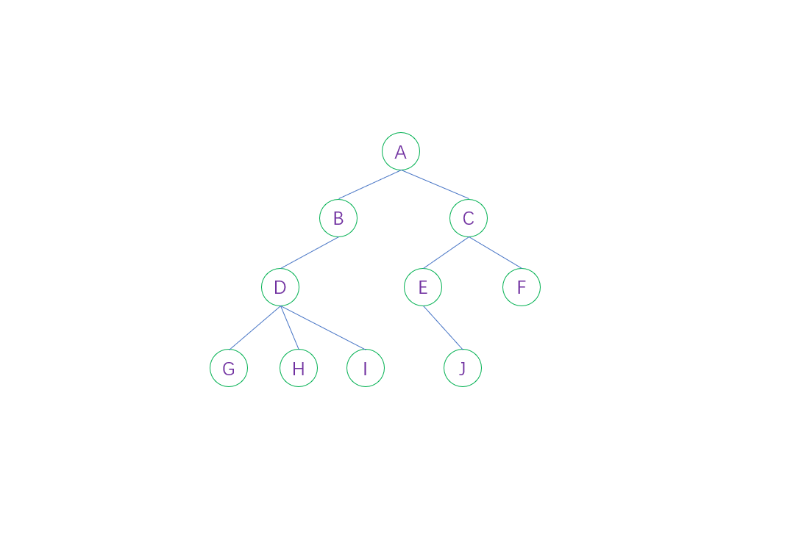

树的相关定义

+ 结点：树中的数据元素
+ 结点的度degree：结点拥有的子树的数目称为度，记作 d(v)
+ 叶子结点：结点的度为0，称为叶子结点 leaf、或者终端结点、或者末端结点
+ 分支结点：结点的度不为0，称为非终端结点或者分支结点
+ 分支：结点之间的关系
+ 内部结点：除根结点外的分支结点，当然也不包括叶子结点
+ 树的度：树的度是树内各结点的度的最大值，如上图，D结点度最大为3，树的度就是3
+ 孩子(儿子Child)结点：结点的子树的根结点成为该结点的孩子
+ 双亲(父Parent)结点：一个结点是它各子树的根结点的双亲
+ 兄弟(Sibling)结点：具有相同双亲结点的结点
+ 祖先结点：从根结点到该结点所经分支上所有的结点，如上图，A B D 都是 G 的祖先结点
+ 子孙结点：结点的所有子树上的结点都称为该结点的子孙，如上图，B 的子孙是 D G H I
+ 结点的层次(Level)：根结点为第一层，根的孩子为第二层，以此类推，记作 L(v)
+ 树的深度或高度(Depth)：树的层次的最大值，上图树的深度为 4
+ 堂兄弟：双亲在同一层的结点
+ 有序树：结点的子树是有顺序的(兄弟有大小，有先后次序)，不能交换
+ 无序树：结点的子树是无序的，可以交换
+ 路径：树中的 K 个结点 n1、n2、......、nk，满足 ni 是 n(i+1) 的双亲，成为 n1 到 nk 的一条路径。就是一条线串下来的，前一个都是后一个的父(前驱)结点
+ 路径长度：路径长度 = 路径上结点数 - 1，也是分支数
+ 森林：m(m>=0) 棵不相交的树的集合
  + 对于结点而言，其子树的集合就是森林，如上图，A 结点的 2 棵子树的集合就是森林

树的特点

+ 唯一的根
+ 子树不相交
+ 除了根以外，每个元素只能有一个前驱，可以有零个或多个后继
+ 根结点没有双亲结点，叶子结点没有孩子结点
+ vi 是 vj 的双亲，则 L(vi) = L(vj) - 1，也就是说双亲比孩子结点的层次小 1
+ 堂兄弟的双亲是兄弟关系吗？
  + 根据堂兄弟的定义，"双亲在同一层的结点"，可知堂兄弟的双亲也有可能是堂兄弟

### 二叉树

二叉树的基本概念

+ 每个结点最多 2 棵子树
  + 二叉树不存在度树大于 2 的结点
+ 它是有序树，左子树，右子树是顺序的，不能交换次序
+ 即使某个结点只有一棵子树，也要确定是左子树还是右子树

二叉树的五种基本形态

+ 空二叉树
+ 只有一个根结点
+ 根结点只有左子树
+ 根结点只有右子树
+ 根结点有左子树和右子树

### 斜树

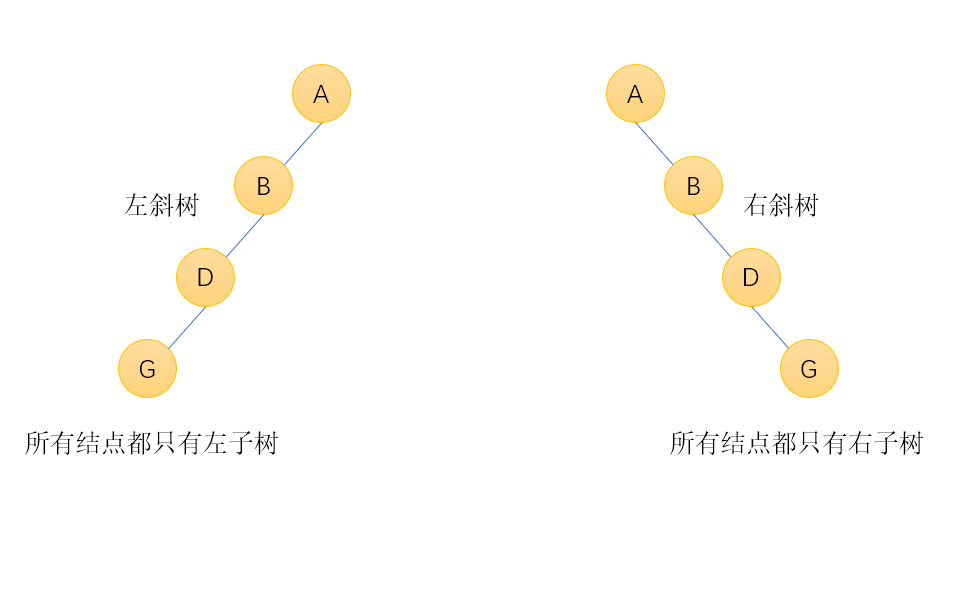

### 满二叉树

满二叉树的基本概念

+ 一棵二叉树的所有分支结点都存在左子树和右子树，并且所有叶子结点都只存在最下面一层
+ 同样深度二叉树中，满二叉树结点最多
+ k 为深度(1 <= k <= n)，则结点总数为 2^k-1
+ 如下图，一个深度为4的15个结点的满二叉树

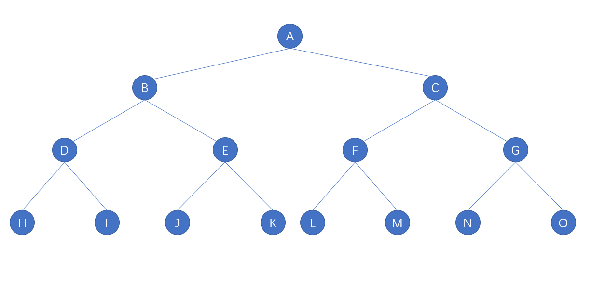

### 完全二叉树(Complete Binary Tree)

完全二叉树的相关概念

+ 若二叉树的深度为 k，二叉树的层数从 1 到 k-1 层的结点数都达到了最大个数，在第 k 层的所有结点都集中在最左边，这就是完全二叉树
+ 完全二叉树由满二叉树引出
+ 满二叉树一定是完全二叉树，但完全二叉树不一定是满二叉树
+ k 为深度(1<=k<=n)，则结点总数最大值为2^k-1，当达到最大值的时候就是满二叉树

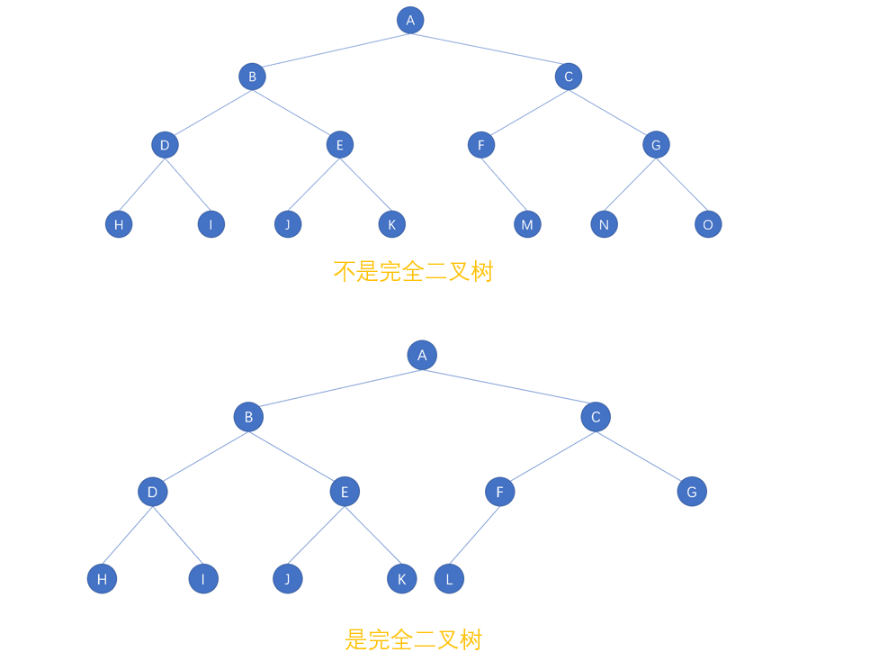

### 二叉树性质

性质1

+ 在二叉树的第 i 层上至多有 2^(i-1) 个结点 (i>=1)

性质2

+ 深度为 k 的二叉树，至多有 2^k-1个结点(k>=1)
+ 一层 2-1 = 1
+ 二层 4-1 = 1+2 = 3
+ 三层 8-1 = 1+2+4 = 7

性质3

+ 对任何一棵二叉树 T，如果其终端结点数为 n0，度数为 2 的结点为 n2，则有 n0=n2+1

```bash
证明此性质
总结点数为 n = n0+n1+n2 (n0 n1 n2指度数为0 1 2的结点数)
一棵树的分支数为 n-1，因为除了根结点外，其余结点都有一个前驱分支，即 n0+n1+n2-1
分支数还等于 n0*0+n1*1+n2*2 即 2*n2+n1
可得 2*n2+n1 = n0+n1+n2-1 即 n2 = n0-1
```

性质4

+ 高度为 k 的二叉树，至少有 k 个结点

+ 含有 n(n>=1) 个结点的二叉树的高度至多为 n，最小为如下公式，不小于对数值的最小整数，向上取整
  $$
  math.ceil(log_2(n+1))
  $$
  + 假设高度为 h，2^h-1 = n，反过来用上面对数公式求值，层次数要取整，如果是 8 个结点，3.1699就要向上取整为4，为4层

性质5

+ 具有 n 个结点的完全二叉树的深度为
  $$
  math.ceil(log_2(n+1)) 或者 int(log_2n)+1
  $$

性质6

+ 如果有一棵 n 个结点的完全二叉树，结点按照层序编号，如下图
+ 如果 i = 1，则结点 i 是二叉树的根，无双亲；如果 i > 1，则其双亲是 int(i/2)，向下取整，就是子结点的编号整除 2 得到的就是父结点的编号，父结点如果是 i，那么左孩子结点就是 2i，右孩子结点就是 2i+1
+ 如果 2i>n，则结点 i 无左孩子，即结点 i 为叶子结点；否则其左孩子结点存在编号为 2i
+ 如果 2i + 1>n，则结点 i 无右孩子，注意这里并不能说明结点 i 没有左孩子；否则右孩子结点存在编号为 2i+1

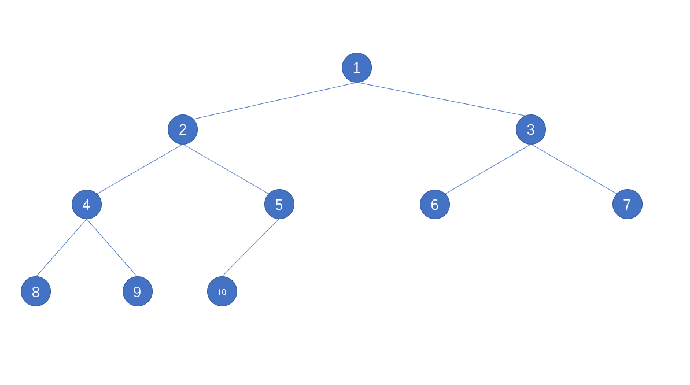

### 二叉树的遍历

遍历：迭代所有元素一遍

树的遍历：对树中所有元素不重复地访问一遍，也称作扫描

树遍历的方式

+ 广度优先遍历
  + 层序遍历
+ 深度优先遍历
  + 前序遍历
  + 中序遍历
  + 后序遍历
+ 遍历序列：将树中所有元素遍历一遍后，得到的元素的序列。将层次结构转换成了线性结构

层序遍历图解

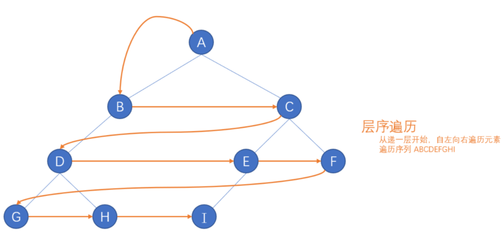

深度优先遍历

设树的根结点为 D，左子树为 L，右子树为 R，且要求 L 一定在 R 之前，则有下面几种遍历方式

1. 前序遍历，也叫先序遍历、也叫先根遍历，DLR
2. 中序遍历，也叫中根遍历，LDR
3. 后序遍历，也叫后根遍历，LRD

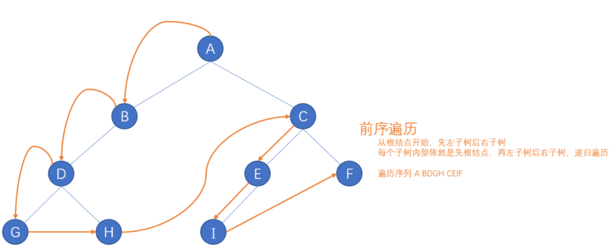

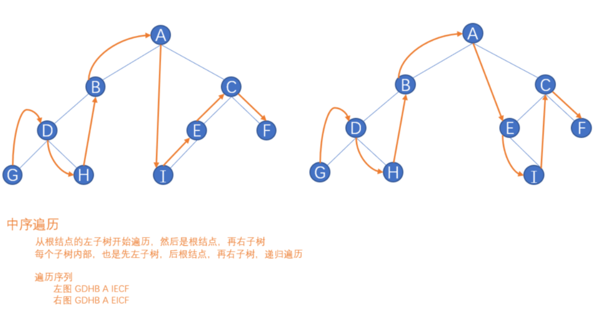

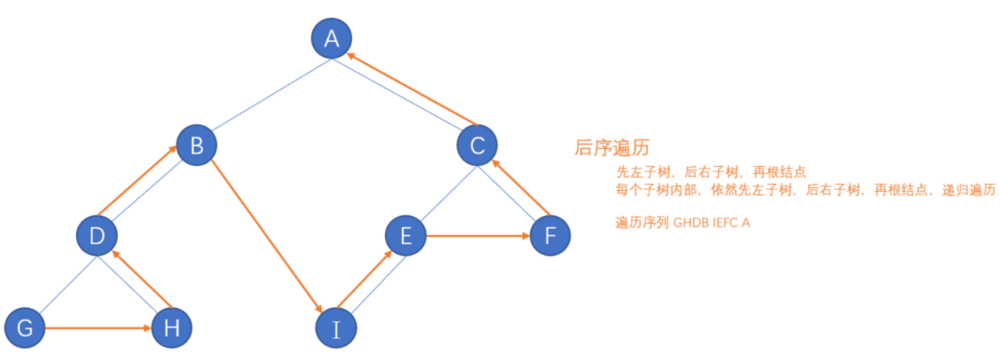

## 堆排序 Heap Sort

> 堆 Heap

+ 堆是一个完全二叉树
+ 每个非叶子结点都要大于或者等于其左右孩子结点的值称为大顶堆
+ 每个非叶子结点都要小于或者等于其左右孩子结点的值称为小顶堆
+ 根结点一定是大顶堆中最大值，小顶堆中最小值

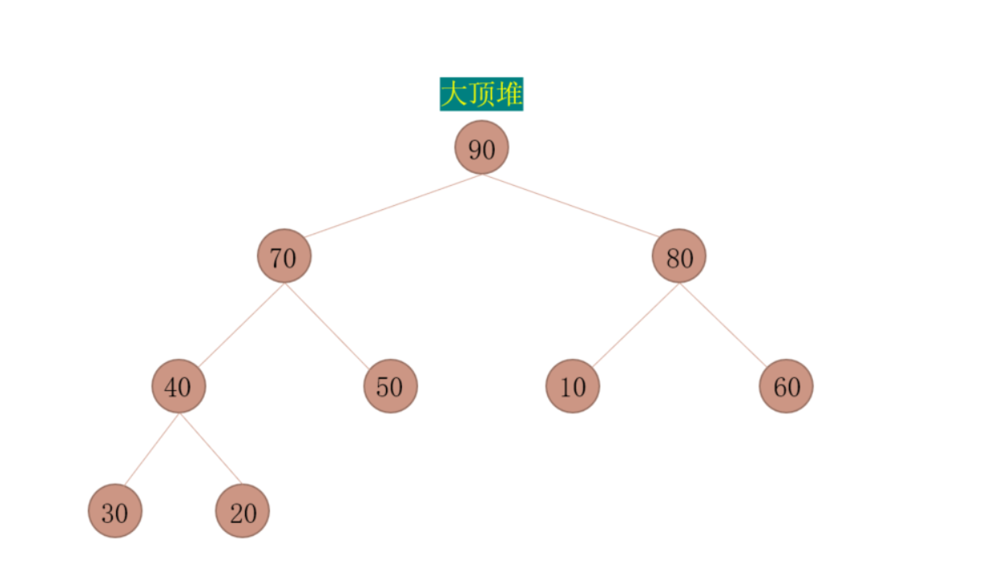

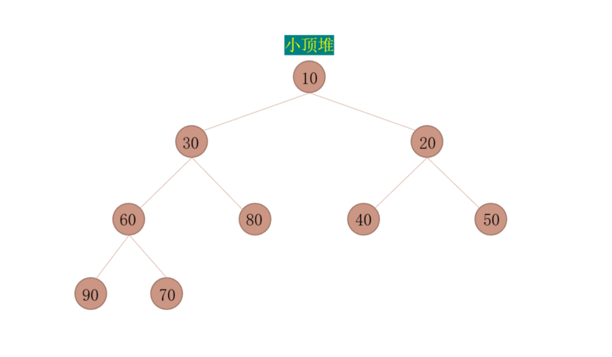

> 构建完全二叉树

1. 待排序数字为 30，20，80，40，50，10，60，70，90
2. 构建一个完全二叉树存放数据，并根据性质 5 对元素编号，放入顺序的数据结构中
3. 构造一个列表为[0,30,20,80,40,50,10,60,70,90]

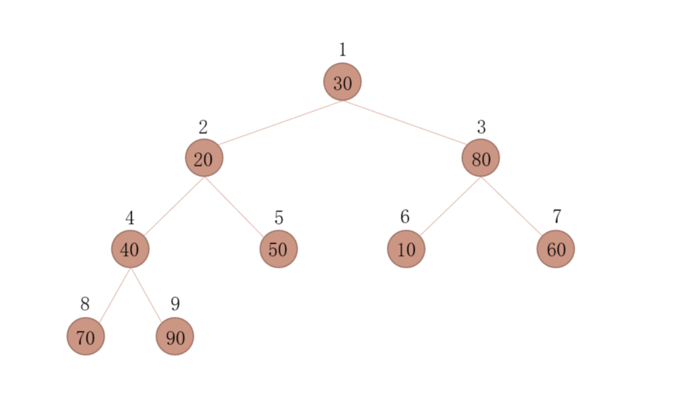

> 构建大顶堆——核心算法

+ 度数为 2 的结点 A，如果它的左右孩子结点的最大值比它大的，将这个最大值和该结点交换
+ 度数为 1 的结点 A，如果它的左孩子的值大于它，则交换
+ 如果结点 A 被交换到新的位置，还需要和其孩子结点重复上面的过程

> 构建大顶堆——起始结点的选择

+ 从完全二叉树最后一个结点的双亲结点开始，即最后一层的最右边叶子结点的父结点开始
+ 结点数为 n，则起始结点的编号为 n//2 (性质5)

> 构建大顶堆——下一个结点的选择

+ 从起始结点开始向左找其同层结点，到头后再从上一层的最右边结点开始继续向左逐个查找，直至根结点

> 排序

+ 将大顶堆根结点这个最大值和最后一个叶子结点交换，那么最后一个叶子结点就是最大值，将这个叶子结点排除在待排序结点之外
+ 从根结点开始（新的根结点），**重新调整为大顶堆**后，重复上一步

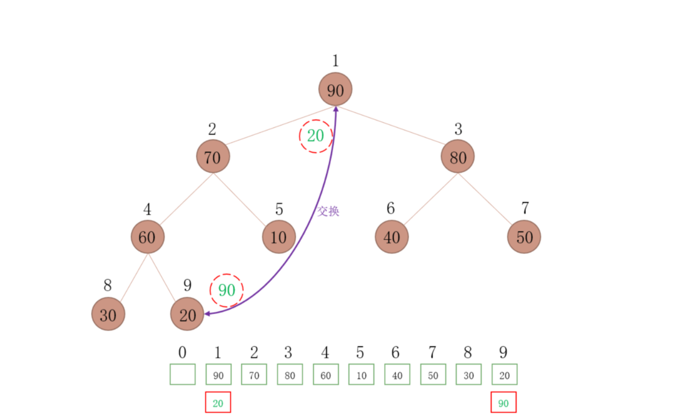

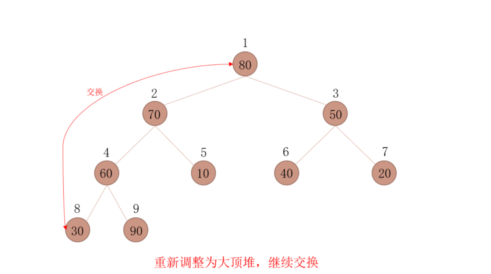

### 堆排序代码实现

有一个树，请打印下面的样子

```bash
origin = [30,20,80,40,50,10,60,70,90] # 数据存在列表中，打印如下的样子，严格对齐，就像二叉树一样
              30
      20              80
  40      50      10      60
70  90
```

代码实现

```bash
import math

# 居中对齐方案
def print_tree(array,unit_width=2):
    length = len(array)
    depth = math.ceil(math.log2(length + 1)) # 4

    index = 0

    width = 2 ** depth - 1 # 行宽，最深的行 15
    for i in range(depth): # 0 1 2 3
        for j in range(2 ** i): # 0:0 1:0,1 2:0,1,2,3 3:0-7
            # 居中打印，后面追加一个空格
            print("{:^{}}".format(array[index],width * unit_width),end=" " * unit_width)

            index += 1
            if index >= length:
                break
        width = width // 2 # 居中打印宽度减半
        print()

print_tree([x+1 for x in range(9)])
----------------------------------------------------------------------------------------
              1
      2               3
  4       5       6       7
8   9
```

**堆调整**的核心算法

1. 度数为 2 的结点 A，如果它的左右孩子结点的最大值比它大的，将这个最大值和该结点交换
2. 度数为 1 的结点 A，如果它的左孩子的值大于它，则交换
3. 如果结点 A 被交换到新的位置，还需要和其孩子结点重复上面的过程

代码实现

```bash
import math

# 居中对齐方案
def print_tree(array,unit_width=2):
    length = len(array)
    depth = math.ceil(math.log2(length + 1)) # 4

    index = 0

    width = 2 ** depth - 1 # 行宽，最深的行 15
    for i in range(depth): # 0 1 2 3
        for j in range(2 ** i): # 0:0 1:0,1 2:0,1,2,3 3:0-7
            # 居中打印，后面追加一个空格
            print("{:^{}}".format(array[index],width * unit_width),end=" " * unit_width)

            index += 1
            if index >= length:
                break
        width = width // 2 # 居中打印宽度减半
        print()


origin = [0,30,20,80,40,50,10,60,70,90] # 加一个 0 让索引从 1 开始

total = len(origin) - 1
print_tree(origin[1:])

def heap_adjust(n,i,array: list):
    """
    调整当前结点(核心算法)

    调整的结点的起点在 n//2，保证所有调整的结点都有孩子结点
    :param n：待比较数个数
    :param i：当前结点的下标
    :param array：待排序数据
    :return：None
    """

    while 2 * i <= n:
        # 孩子结点判断 2i 为左孩子，2i+1 为右孩子
        lchild_index = 2 * i
        # 先假定左孩子大，如果存在右孩子且大则最大孩子索引就是右孩子
        max_child_index = lchild_index # n=2i
        if n > lchild_index and array[lchild_index + 1] > array[lchild_index]: # n > 2i 说明还有右孩子
            max_child_index = lchild_index + 1 # n=2i+1

        # 和子树的根结点比较
        if array[max_child_index] > array[i]:
            array[i],array[max_child_index] = array[max_child_index],array[i]
            i = max_child_index
        else:
            break

heap_adjust(total,total//2,origin)
print(origin)
print_tree(origin[1:])
-------------------------------------------------------------------------------------------------------
              30
      20              80
  40      50      10      60
70  90  
[0, 30, 20, 80, 90, 50, 10, 60, 70, 40]
              30
      20              80
  90      50      10      60
70  40
```

到目前为止也只是解决了**单个结点的调整**，下面要使用循环来依次解决比起始结点编号小的结点

构建大顶堆起点的选择

+ 从最下层最右边叶子结点的父结点开始
+ 由于构造了一个前置的 0，所以编号和列表的索引正好重合，但是，元素个数等于长度减 1
+ 下一个结点，按照二叉树性质 5 编号的结点，从起点开始找编号逐个递减的结点，直到编号 1

```bash
import math

# 居中对齐方案
def print_tree(array,unit_width=2):
    length = len(array)
    depth = math.ceil(math.log2(length + 1)) # 4

    index = 0

    width = 2 ** depth - 1 # 行宽，最深的行 15
    for i in range(depth): # 0 1 2 3
        for j in range(2 ** i): # 0:0 1:0,1 2:0,1,2,3 3:0-7
            # 居中打印，后面追加一个空格
            print("{:^{}}".format(array[index],width * unit_width),end=" " * unit_width)

            index += 1
            if index >= length:
                break
        width = width // 2 # 居中打印宽度减半
        print()


origin = [0,30,20,80,40,50,10,60,70,90] # 加一个 0 让索引从 1 开始

total = len(origin) - 1
print_tree(origin[1:])

def heap_adjust(n,i,array: list):
    """
    调整当前结点(核心算法)

    调整的结点的起点在 n//2，保证所有调整的结点都有孩子结点
    :param n：待比较数个数
    :param i：当前结点的下标
    :param array：待排序数据
    :return：None
    """

    while 2 * i <= n:
        # 孩子结点判断 2i 为左孩子，2i+1 为右孩子
        lchild_index = 2 * i
        # 先假定左孩子大，如果存在右孩子且大则最大孩子索引就是右孩子
        max_child_index = lchild_index # n=2i
        if n > lchild_index and array[lchild_index + 1] > array[lchild_index]: # n > 2i 说明还有右孩子
            max_child_index = lchild_index + 1 # n=2i+1

        # 和子树的根结点比较
        if array[max_child_index] > array[i]:
            array[i],array[max_child_index] = array[max_child_index],array[i]
            i = max_child_index
        else:
            break
def max_heap(total,array:list):
    for i in range(total//2,0,-1):
        heap_adjust(total,i,array)
    return array
print_tree(max_heap(total,origin)[1:])
-------------------------------------------------------------------------------------------------------
              30
      20              80
  40      50      10      60
70  90  
              90
      70              80
  40      50      10      60
20  30
```

小结一下实现的大顶堆的一些特点

+ 最大的值一定在第一层，第二层一定有一个次大的
+ 按照以上算法一定可以调整出大顶堆，但不一定是一模一样的大顶堆，位置可能存在差别

排序思路

1. 每次都要让堆顶的元素和最后一个结点交换，然后排除最后一个元素，形成一个新的被破坏的堆
2. 让它重新调整，调整后，堆顶一定是最大的元素
3. 再次重复1、2步直至剩余一个元素

```bash
import math

# 居中对齐方案
def print_tree(array,unit_width=2):
    length = len(array)
    depth = math.ceil(math.log2(length + 1)) # 4

    index = 0

    width = 2 ** depth - 1 # 行宽，最深的行 15
    for i in range(depth): # 0 1 2 3
        for j in range(2 ** i): # 0:0 1:0,1 2:0,1,2,3 3:0-7
            # 居中打印，后面追加一个空格
            print("{:^{}}".format(array[index],width * unit_width),end=" " * unit_width)

            index += 1
            if index >= length:
                break
        width = width // 2 # 居中打印宽度减半
        print()

origin = [0,30,20,80,40,50,10,60,70,90] # 加一个 0 让索引从 1 开始

total = len(origin) - 1
print_tree(origin[1:])

def heap_adjust(n,i,array: list):
    """
    调整当前结点(核心算法)

    调整的结点的起点在 n//2，保证所有调整的结点都有孩子结点
    :param n：待比较数个数
    :param i：当前结点的下标
    :param array：待排序数据
    :return：None
    """

    while 2 * i <= n:
        # 孩子结点判断 2i 为左孩子，2i+1 为右孩子
        lchild_index = 2 * i
        # 先假定左孩子大，如果存在右孩子且大则最大孩子索引就是右孩子
        max_child_index = lchild_index # n=2i
        if n > lchild_index and array[lchild_index + 1] > array[lchild_index]: # n > 2i 说明还有右孩子
            max_child_index = lchild_index + 1 # n=2i+1

        # 和子树的根结点比较
        if array[max_child_index] > array[i]:
            array[i],array[max_child_index] = array[max_child_index],array[i]
            i = max_child_index
        else:
            break

def max_heap(total,array:list):
    for i in range(total//2,0,-1):
        heap_adjust(total,i,array)
    return array
print_tree(max_heap(total,origin)[1:])

def sort(total,array:list):
    while total > 1:
        array[1],array[total] = array[total],array[1]
        total -= 1

        heap_adjust(total,1,array)

    return array

print_tree(sort(total,origin)[1:])

```

**改进**，如果最后剩余两个元素的时候，如果后一个结点比堆顶大，就不用调整了

```bash
def sort(total,array:list):
    while total > 1:
        array[1],array[total] = array[total],array[1]
        total -= 1

        if total == 2 and array[total] >= array[total - 1]:
            break

        heap_adjust(total,1,array)

    return array
```

思考：如果有 n 个结点全部是 90，能在哪些地方优化？如果最后一个叶子结点正好是堆顶，就代表树中元素都相等？

```bash
# 反例
  90
80  90
```

堆排序总结

1. 是利用堆性质的一种选择排序，在堆顶选出最大值或者最小值
2. 时间复杂度
   1. 堆排序的时间复杂度为O(nlogn)
   2. 由于堆排序对原始记录的排序状态并不敏感，因此它无论是最好、最坏和平均时间复杂度均为O(nlogn)
3. 空间复杂度
   1. 只是使用了一个交换用的空间，空间复杂度就是O(1)
4. 稳定性
   1. 不稳定的排序算法
5. 相比较之前的三种排序算法，是 n * n 与 nlogn 的差别，所以堆排序更高效

## 数据结构共性

> 线性结构

+ 可迭代(for...in)
+ len()可以获取长度
+ 通过下标可以访问
+ 可以切片

> 学过的线性结构

+ 列表
+ 元组
+ 字符串
+ bytes
+ bytearray

> 切片

+ 通过索引区间访问线性结构的一段数据
+ sequence[start:stop] 表示返回[start, stop)区间的子序列
+ 支持负索引
+ start为0，可以省略
+ stop为末尾，可以省略
+ 超过上界（右边界），就取到末尾；超过下界（左边界），取到开头
+ start一定要在stop的左边
+ [:] 表示从头至尾，全部元素被取出，等效于copy()方法

```bash
print('www.magedu.com'[4:10])
print('www.magedu.com'[:10])
print('www.magedu.com'[4:])
print('www.magedu.com'[:])
print('www.magedu.com'[:-1])
print('www.magedu.com'[4:-4])
print('www.magedu.com'[4:50])
print(b'www.magedu.com'[-40:10])
print(bytearray(b'www.magedu.com')[-4:10])
print(tuple('www.magedu.com')[-10:10])
print(list('www.magedu.com')[-10:-4])
---------------------------------------------------------------------------
magedu
www.magedu
magedu.com
www.magedu.com
www.magedu.co
magedu
magedu.com
b'www.magedu'
bytearray(b'')
('m', 'a', 'g', 'e', 'd', 'u')
['m', 'a', 'g', 'e', 'd', 'u']
```

> 步长切片

+ [start:stop:step]
+ step为步长，可以正、负整数，默认是1
+ step要和start:stop同向，否则返回空序列

```bash
print('www.magedu.com'[4:10:2])
print(list('www.magedu.com')[4:10:-2])
print(tuple('www.magedu.com')[-10:-4:2])
print(b'www.magedu.com'[-4:-10:2])
print(bytearray(b'www.magedu.com')[-4:-10:-2])
---------------------------------------------------------------------------
mgd
[]
('m', 'g', 'd')
b''
bytearray(b'.dg')
```

## 封装和解构

> 封装

+ 将多个值使用逗号分割，组合在一起
+ 本质上，返回一个元组，只是省掉了小括号
+ python特有语法，被很多语言学习和借鉴

```bash
t1 = (1,2) # 定义为元组
t2 = 1,2 # 将1和2封装成元组
print(type(t1))
print(type(t2))
---------------------------------------------------------------------------
<class 'tuple'>
<class 'tuple'>
```

```bash
a = 4
b = 5
temp = a
a = b
b = temp
等价于
a, b = b, a
上句中，等号右边使用了封装，而左边就使用了解构
```

> 解构

+ 把**线性结构**的元素解开，并**顺序**的赋给其它变量
+ 左边接纳的变量数要和右边解开的元素个数一致

```bash
lst = [3, 5]
first, second = lst
print(first, second)
---------------------------------------------------------------------------
3 5
```

```bash
a,b,c,d,e,f,g = 1,2,3,4,5,6,7
print(a,b,c,d,e,f,g)
---------------------------------------------------------------------------
1 2 3 4 5 6 7

a,b,c,d,e,f,g = (1,2,3,4,5,6,7)
print(a,b,c,d,e,f,g)
---------------------------------------------------------------------------
1 2 3 4 5 6 7

a,b,c,d,e,f,g = [1,2,3,4,5,6,7]
print(a,b,c,d,e,f,g)
---------------------------------------------------------------------------
1 2 3 4 5 6 7

注：线性结构都是顺序解构
```

```bash
a,b,c,d,e,f,g = {10,20,30,40,50,60,70}
print(a,b,c,d,e,f,g)
---------------------------------------------------------------------------
70 40 10 50 20 60 30

a,b,c,d,e,f,g = {'A':10,'B':20,'C':30,'Z':40,'E':50,'F':60,'G':70}
print(a,b,c,d,e,f,g)
---------------------------------------------------------------------------
A B C Z E F G

注：非线性结构也可以解构，但是不保证顺序解构
```

```bash
a,b = {10,20,30}
---------------------------------------------------------------------------
ValueError                                Traceback (most recent call last)
<ipython-input-33-23ffdd85902f> in <module>
----> 1 a,b = {10,20,30}
ValueError: too many values to unpack (expected 2)


a,b,c,d,*e = {10,20,30,40,50,60,70}
print(a,b,c,d,e)
---------------------------------------------------------------------------
70 40 10 50 [20, 60, 30]

注：封装和解构两边元素个数要一致，或者用*号尽可能多地拿元素，另外注意非线性的无序性
```

```bash
[a,b,c,d,e,f,g] = (1,2,3,4,5,6,7)
print(a,b,c,d,e,f,g)
---------------------------------------------------------------------------
1 2 3 4 5 6 7

[a,b,c,d,e,f,g] = 1,2,3,4,5,6,7
print(a,b,c,d,e,f,g)
---------------------------------------------------------------------------
1 2 3 4 5 6 7

(a,b,c,d,e,f,g) = {10,20,30,40,50,60,70}
print(a,b,c,d,e,f,g)
---------------------------------------------------------------------------
70 40 10 50 20 60 30

注：封装解构比较灵活
```

+ 使用 *变量名 接收，但不能单独使用
+ 被 *变量名 收集后组成一个列表

```bash
lst = list(range(1,10,2))

head,*mid,tail = lst
print(head,mid,tail)
---------------------------------------------------------------------------
1 [3, 5, 7] 9

*lst2 = lst
---------------------------------------------------------------------------
File "<ipython-input-48-419bc512b767>", line 4
SyntaxError: starred assignment target must be in a list or tuple
注：星号分配目标必须在列表或元组中

*body,tail = lst
print(body,tail)
---------------------------------------------------------------------------
[1, 3, 5, 7] 9

head, *m1, *m2, tail = lst
---------------------------------------------------------------------------
File "<ipython-input-55-310992efb43d>", line 4
SyntaxError: two starred expressions in assignment

head, *mid, tail = "abcdefghijklmn"
print(mid)
type(mid)
---------------------------------------------------------------------------
['b', 'c', 'd', 'e', 'f', 'g', 'h', 'i', 'j', 'k', 'l', 'm']
list
```

> 丢弃变量

+ 这是一个惯例，是一个不成文的约定，不是标准
+ 如果不关心一个变量，就可以定义改变量的名字为_
+ _是一个合法的标识符，也可以作为一个有效的变量使用，但是定义成下划线就是希望不要被使用，除非你明确的知道这个数据需要使用

```bash
lst = [9,8,7,20]
first, *second = lst
print(first,second)

head, *_, tail = lst
print(head)
print(tail)
# _是合法的标识符，看到下划线就知道这个变量就是不想被使用
print(_)
---------------------------------------------------------------------------
9 [8, 7, 20]
9
20
[8, 7]
```

```bash
lst = [9,8,7,20]
first, *second = lst
_, *_, tail = lst
print(_)
print(tail)
print(_)
---------------------------------------------------------------------------
[8, 7]
20
[8, 7]
注：这个结果可能有点迷惑，后面的*_把前面的_给顶替掉了
```

+ _ 这个变量本身无任何语义，没有任何可读性，所以不是用来给人使用的
+ Python中很多库，都使用这个变量，使用十分广泛。请不要在不明确变量作用域的情况下，使用 \_ 导致和库中\_ 冲突

> 练习

+ lst = list(range(10)) # 这样一个列表，取出第二个、第四个、倒数第二个

```bash
lst = list(range(10))
_,second,_,forth,*_,tailsecond,_ = lst
print(second,forth,tailsecond)
---------------------------------------------------------------------------
1 3 8
```

+ 从lst = [1,(2,3,4),5]中，提取4出来

```bash
lst = [1,(2,3,4),5]
a,(b,c,d),e = lst
print(a,b,c,d,e)
---------------------------------------------------------------------------
1 2 3 4 5

lst = [1,(2,3,4),5]
_,(*_,val),*_ = lst
print(val)
---------------------------------------------------------------------------
4

lst = [1,(2,3,4),5]
_,[*_,val],*_ = lst
print(val)
---------------------------------------------------------------------------
4
```

+ 环境变量JAVA_HOME=/usr/bin，返回环境变量名和路径

```bash
key,_,val = "JAVA_HOME = /usr/bin".partition('=')
print(key)
print(val)
---------------------------------------------------------------------------
JAVA_HOME
 /usr/bin
```

> 总结

+ 解构，是Python提供的很好的功能，可以方便的提取复杂数据结构的值
+ 配合 _ 的使用，会更加便利

> 列表解析式练习

+ 返回 1-10 平方的列表

```bash
[ x ** 2 for x in range(1,11)]
---------------------------------
[1, 4, 9, 16, 25, 36, 49, 64, 81, 100]
```

+ 有一个列表lst = [1,4,9,16,2,5,10,15]，生成一个新列表，要求新列表元素是lst相邻2项的和

```bas
lst = [1,4,9,16,2,5,10,15]
[ lst[i]+lst[i+1] for i in range(len(lst)-1)]
---------------------------------------------
[5, 13, 25, 18, 7, 15, 25]
```

+ 打印九九乘法表

```bash
[print("{} * {} = {:<2}{}".format(j,i,i*j,"\n"if i == j else " "),end="") for i in range(1,10) for j in range(1,i+1)]
-----------------------------------------------------------------------------------------
1 * 1 = 1
1 * 2 = 2  2 * 2 = 4
1 * 3 = 3  2 * 3 = 6  3 * 3 = 9
1 * 4 = 4  2 * 4 = 8  3 * 4 = 12 4 * 4 = 16
1 * 5 = 5  2 * 5 = 10 3 * 5 = 15 4 * 5 = 20 5 * 5 = 25
1 * 6 = 6  2 * 6 = 12 3 * 6 = 18 4 * 6 = 24 5 * 6 = 30 6 * 6 = 36
1 * 7 = 7  2 * 7 = 14 3 * 7 = 21 4 * 7 = 28 5 * 7 = 35 6 * 7 = 42 7 * 7 = 49
1 * 8 = 8  2 * 8 = 16 3 * 8 = 24 4 * 8 = 32 5 * 8 = 40 6 * 8 = 48 7 * 8 = 56 8 * 8 = 64
1 * 9 = 9  2 * 9 = 18 3 * 9 = 27 4 * 9 = 36 5 * 9 = 45 6 * 9 = 54 7 * 9 = 63 8 * 9 = 72 9 * 9 = 81
```
