# 安装windows pyenv
## 下载python
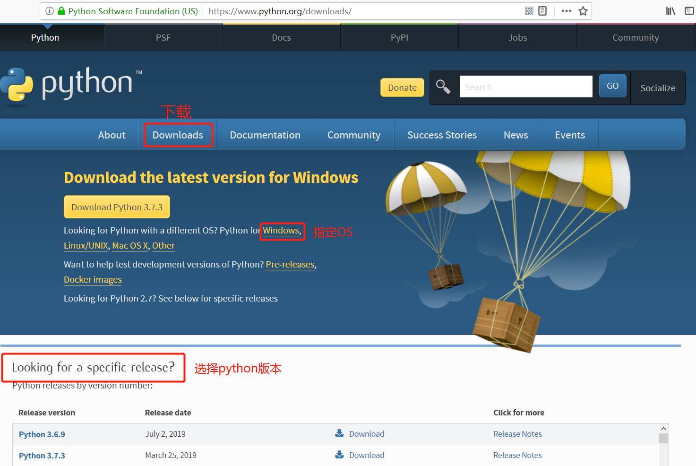
> 找到python对应版本位置   

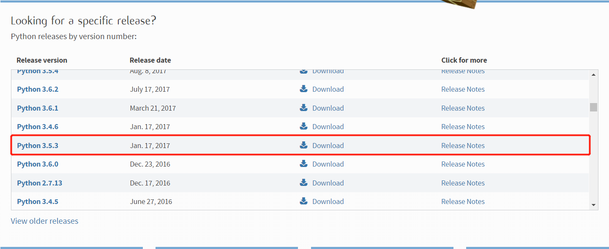

> 点进去找到windows版本下载   

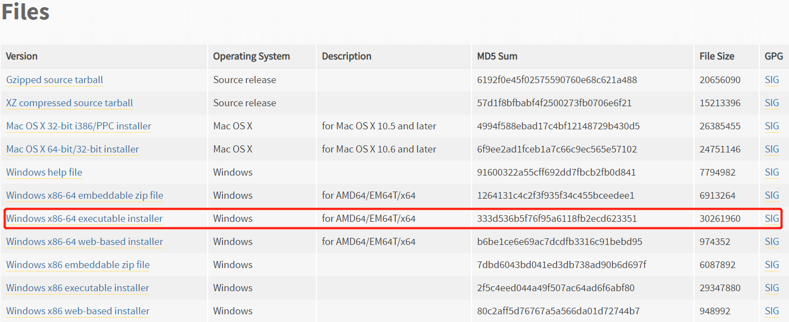

## 安装python
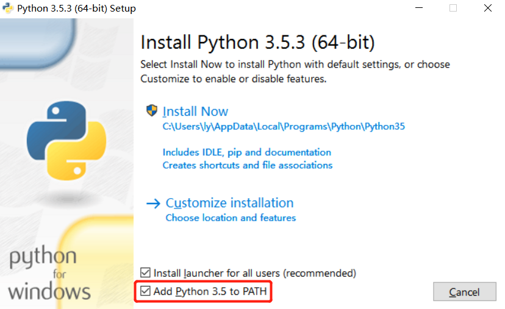   
+ 勾选将python3.5加入到PATH路径   
+ 选择install now，它里面包括了pip包管理   


+ 安装完成


## 检验
> 运行windows CMD打开命令行界面   

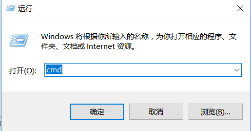

> 输入path命令   

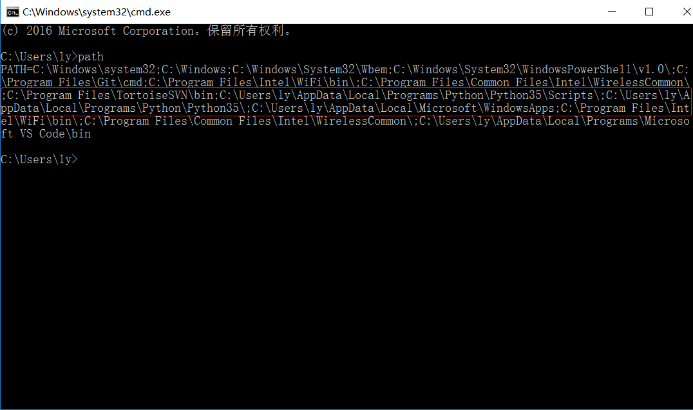
+ 这就是python的安装路径

## 使用python
> 测试python和pip的版本   

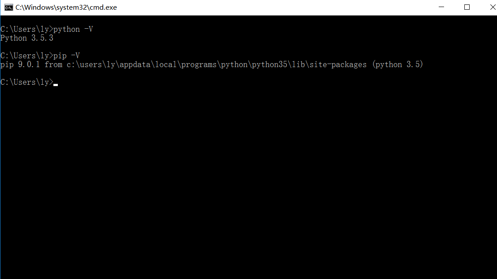

> 打开python交互式界面   

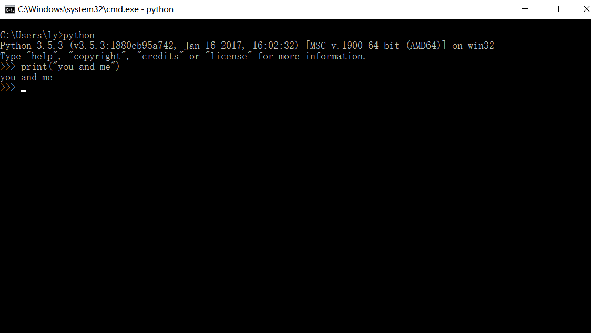

## 安装ipython
> 命令行中输入pip install ipython   

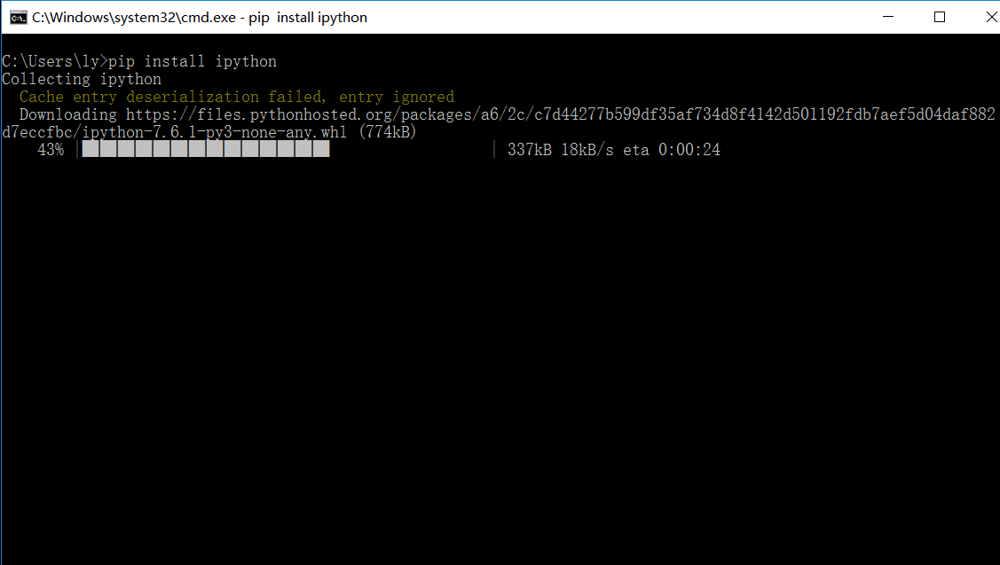

> 安装完成后输入ipython进入交互式界面   

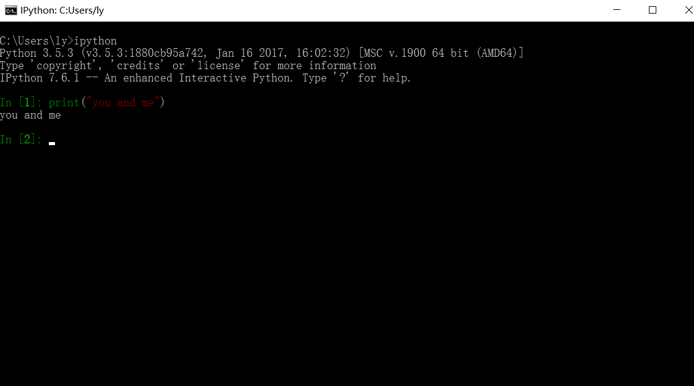

## 安装jupyter
> 通过pip像安装ipyhton一样安装jupyter   

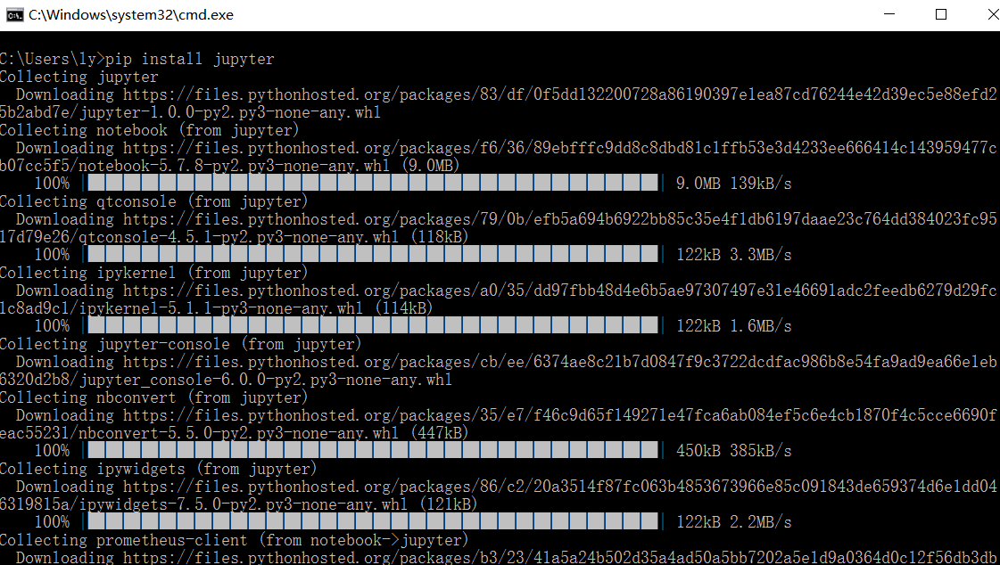

> 运行jupyter   

```bash
$ jupyter notebook
```
+ 打开windows下的浏览器，输入http://127.0.0.1:8888


