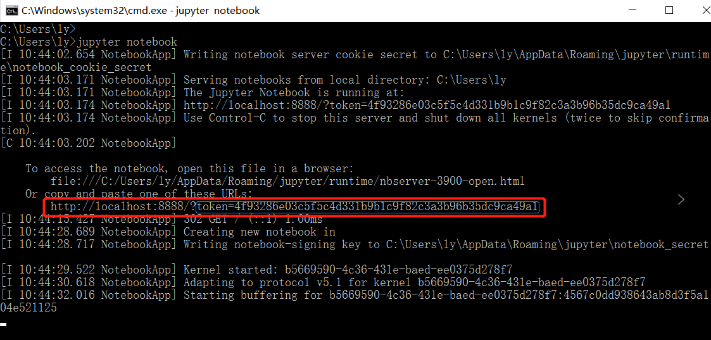
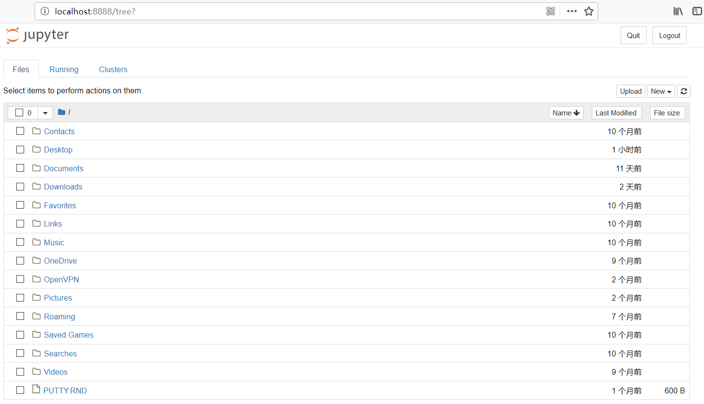
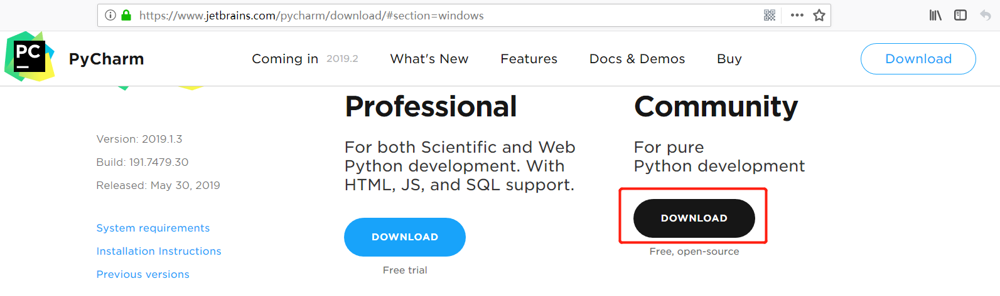
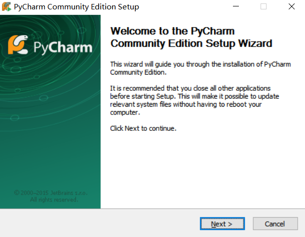
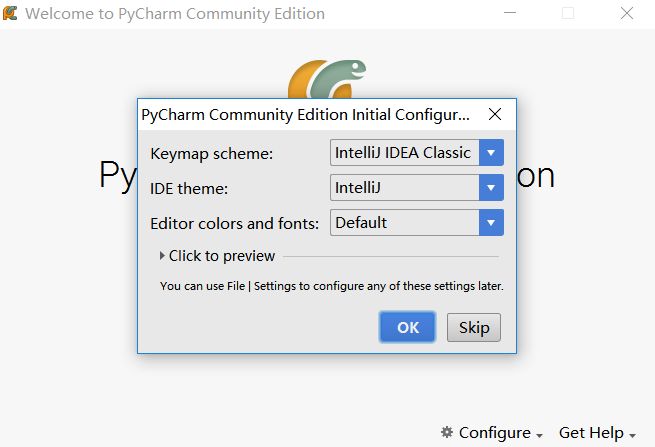
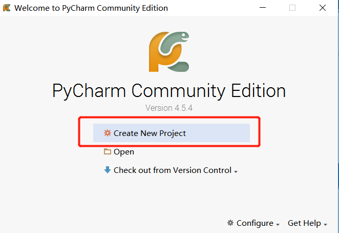
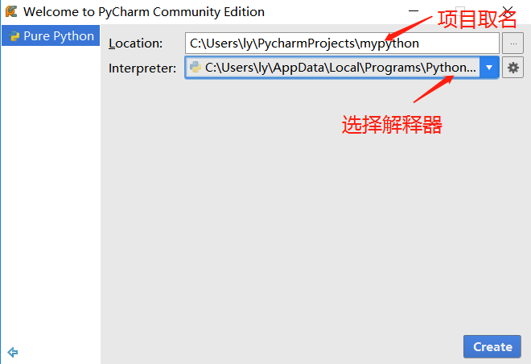
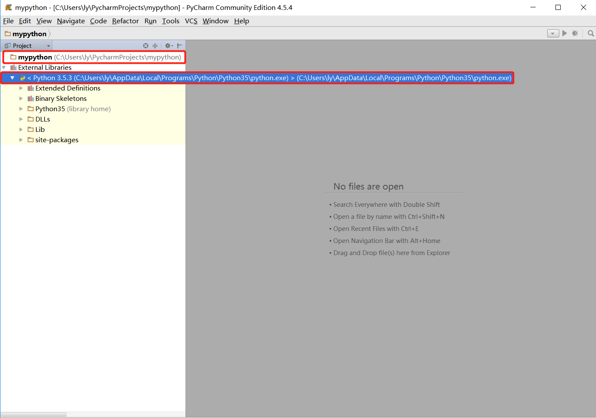
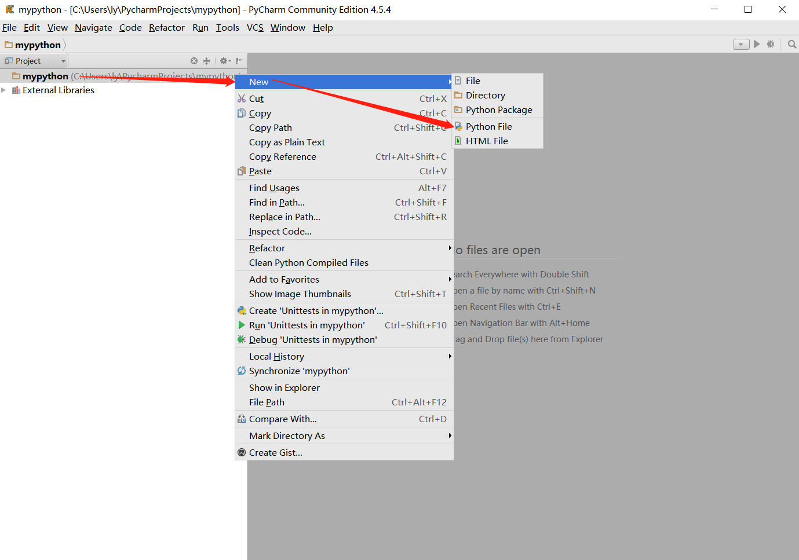
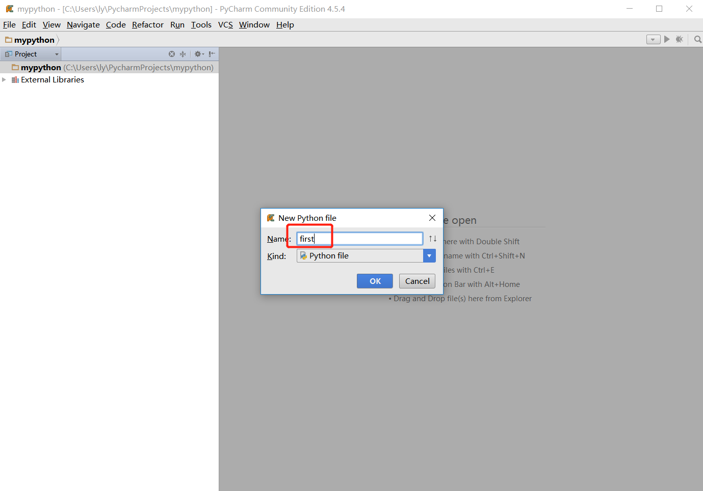

# 安装windows pyenv
## 下载python

> 找到python对应版本位置   


> 点进去找到windows版本下载   


## 安装python
   
+ 勾选将python3.5加入到PATH路径   
+ 选择install now，它里面包括了pip包管理   


+ 安装完成


## 检验
> 运行windows CMD打开命令行界面   


> 输入path命令   


+ 这就是python的安装路径

## 使用python
> 测试python和pip的版本   


> 打开python交互式界面   


## 安装ipython
> 命令行中输入pip install ipython   


> 安装完成后输入ipython进入交互式界面   


## 安装jupyter
> 通过pip像安装ipyhton一样安装jupyter   


> 运行jupyter   

```bash
$ jupyter notebook
```

+ 打开windows下的浏览器，输入http://127.0.0.1:8888
+ 注意第一次通过浏览器登陆，可能会要求输入密码或者token，使用运行界面中输出的token即可



## 安装pycharm
> 下载pycharm   


> 选择社区版下载就够用



> 开始安装   


+ 按提示直接安装即可

> 第一次启动pycharm



> 第一次设置pycharm







> 创建python文件   



> 输入一个文件名first，会生成first.py文件   



> 输入一行语句，然后运行


